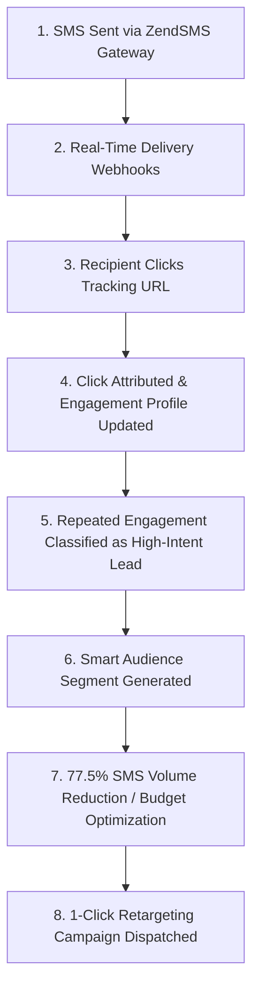

# SMSPro — Trackable SMS Marketing & Customer Engagement Platform

SMSPro is a production-grade, multi-tenant enterprise SaaS platform engineered for trackable SMS marketing, per-recipient link click attribution, real-time engagement intelligence, and algorithmic high-intent lead retargeting.

---

## 🚀 Core Value Proposition & Business Loop



---

## 🛠 Tech Stack

- **Framework**: Next.js 15+ (App Router, Server & Client Components)
- **Language**: TypeScript (Strict Mode)
- **Styling**: Vanilla Tailwind CSS, Radix UI Primitives, Lucide Icons
- **Data & Persistence**: MongoDB Atlas via Mongoose (with tenant compound indexes)
- **Queue Architecture**: BullMQ + Redis (with resilient in-memory/MongoDB fallback)
- **SMS Gateway**: ZendSMS Official Provider Adapter (API Key: `sk_agowwwg3j8x8u8o5opcwoyqgxii2zafmikbxtfxo`, Sender ID: `8809612781020`)
- **Authentication**: JWT Sessions (`jose` HS256) with HTTP-only cookies and RBAC
- **Validation**: Zod (100% schema coverage)
- **Testing**: Vitest automated unit & integration test suites

---

## 📦 Getting Started

### 1. Installation
```bash
npm install
```

### 2. Environment Setup
Create a `.env.local` file:
```env
NEXT_PUBLIC_APP_URL=http://localhost:3000
MONGODB_URI=your_mongodb_atlas_connection_string
AUTH_SECRET=your_jwt_secret_key_at_least_32_chars_long
TRACKING_BASE_URL=http://localhost:3000/t

# SMS Provider (ZendSMS)
SMS_PROVIDER=zendsms
ZENDSMS_API_URL=https://api.zendsms.com/api/v1/send-sms
ZENDSMS_BALANCE_URL=https://api.zendsms.com/api/v1/balance
ZENDSMS_API_KEY=your_zendsms_api_key
ZENDSMS_SENDER_ID=8809612781020
```

### 3. Seed Database
Populate MongoDB Atlas with 128 campaigns, 5,000 recipients, tracking mappings, and smart leads:
```bash
npm run seed
```

### 4. Run Development Server
```bash
npm run dev
```
Open [http://localhost:3000](http://localhost:3000) to access the application.

### 5. Automated Tests
```bash
npm test
```

### 6. Production Build
```bash
npm run build
npm run start
```

---

## 📱 Core Application Screens

1. **Dashboard (`/dashboard`)**: 6 KPI cards, Click Engagement Over Time chart, Engagement Intelligence card, Campaign Performance table, and 5-stage conversion funnel.
2. **Campaigns (`/campaigns`)**: Filterable and searchable campaign list with status badges and CTR analytics.
3. **Create Campaign Wizard (`/campaigns/new`)**: 4-step wizard with SMS segment counter, `{TRACKABLE_LINK}` merge tag, and mobile preview.
4. **Unique Link Generator (`/link-generator`)**: Cryptographic short ID generator with collision retry and recipient-campaign mapping.
5. **Delivery Queue (`/delivery-queue`)**: 6 KPI cards, live queue telemetry, and ZendSMS Gateway Health monitor.
6. **Click Analytics (`/click-analytics`)**: User-level click attribution table and conversion funnel.
7. **Active Leads (`/active-leads`)**: Smart audience rules (>=3 campaigns, >=2 clicks, within 30 days), 77.5% volume reduction calculation, and 1-click retargeting.
8. **Audience Segments (`/audiences`)**: Composable rule builder with audience count preview.
9. **Reports (`/reports`)**: Aggregated delivery and click performance metrics with CSV export.
10. **Settings (`/settings`)**: ZendSMS Gateway credentials, live credit balance check, and Test SMS dispatcher.
